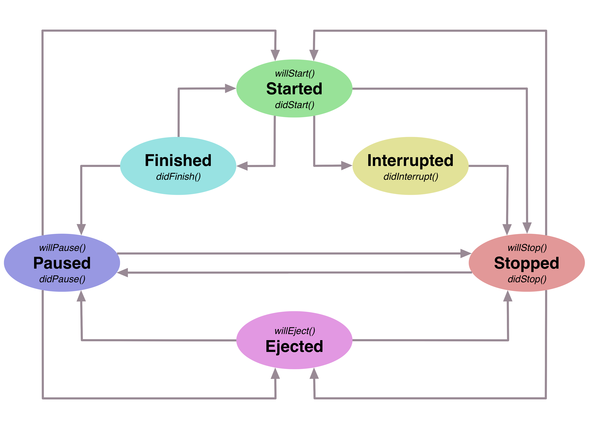

# kjob-android
Utility for asynchronous job in Android apps.

[]()
[]()

Library contains class `Job` which provides different utilities for asynchronous job. `Job` object incapsulates a command chain where each command may be executed in thread with necessary priority.
There is a posibility to suspend commands and cancel commands from job chain.

## Basic commands

For sake of facilitation, library include static methods which duplicate instance methods, for example code

```java
Job job = Job.doingInBackground(
    new Actable() {
        @Override
        public void act() throws Exception {
            // do something
        }
    }
);
```
performs standalone actions in thread with `Process.THREAD_PRIORITY_BACKGROUND` priority and code

```java
job.doInBackground(
    new Actable() {
        @Override
        public void act() throws Exception {
            // do something
        }
    }
);
```

do the same thing. Every method returns `Job` object, so you can easily make up command chains like that:

```java
Job.doingInBackground(
    new Actable() {
        @Override
        public void act() throws Exception {
            // do something in thread with Process.THREAD_PRIORITY_BACKGROUND priority
        }
    }
).doInMain(
    new Actable() {
        @Override
        public void act() throws Exception {
            // do something in main thread
        }
    }
).doInForeground(
    new Actable() {
        @Override
        public void act() throws Exception {
            // do something in thread with Process.THREAD_PRIORITY_FOREGROUND priority
        }
    }
);
```

We may execute commands with delay like that

```java
Job.doingInBackground(2.0, 
    new Actable() {
        @Override
        public void act() throws Exception {
            // do something with delay for 2 seconds
        }
    }
);
```

We may await when the last command in the job will be completed:

```java
Job job = Job.doingInBackground(
    new Actable() {
        @Override
        public void act() throws Exception {
            // do action 1
        }
    }
).doInMain(
    new Actable() {
        @Override
        public void act() throws Exception {
            // do action 2
        }
    }
).await();
// do something after action 2 is completed
```

Also we may await for not more then specified amount of seconds:

```java
job.doInBackground(
    new Actable() {
        @Override
        public void act() throws Exception {
            // do action 3
        }
    }
);
job.doInMain(
    new Actable() {
        @Override
        public void act() throws Exception {
            // do action 4
        }
    }
);
boolean waited = job.await(10.0);
// do something after action 4 is completed or after 10 seconds
```

Method `await` returns boolean value which means whether we waited the complition of the last command or not.

You may add and remove custom tagged queues globally like that:

```java
Job.addQueue("CUSTOM_QUEUE_TAG", Process.THREAD_PRIORITY_BACKGROUND);
...
Job.removeQueue("CUSTOM_QUEUE_TAG");
```

After we added custom tagged queue we may refer to this queue from different job instances:

```java
Job job1 = ...
Job job2 = ...

job1.doInCustom("CUSTOM_QUEUE_TAG", 
    new Actable() {
        @Override
        public void act() throws Exception {
            // do action 1
        }
    }
);

job2.doInCustom("CUSTOM_QUEUE_TAG", 
    new Actable() {
        @Override
        public void act() throws Exception {
            // do action 2 after action 1 is completed
        }
    }
);
```

In this case `action 2` will be executed only after `action 1` because we do this actions in the same custom queue tagged with `"CUSTOM_QUEUE_TAG"`.

Along with standalone actions there are some special types of commands.

### Target-Action commands

We can perform actions on specified targets

```java
Job.addTarget(TargetA.INSTANCE);
Job.addTarget(TargetB.INSTANCE);

Job.doingInBackground(
    new ActableO<TargetA>() {
        @Override
        public void act(TargetA object) throws Exception {
            // do something with target A
        }
    }
).doInMain(
    new ActableO<TargetB>() {
        @Override
        public void act(TargetB object) throws Exception {
            // do something with target B
        }
    }
);
```

As you can see we added target A and target B so that we might do actions on this targets. 

If we had not added any target to `Job` or we had removed any target after addition, action would not have been performed on this target.

```java
Job.addTarget(TargetA.INSTANCE);

// this action will be executed because we added target A
Job job = Job.doingInBackground(
    new ActableO<TargetA>() {
        @Override
        public void act(TargetA object) throws Exception {
            // do something with target A
        }
    }
);

Job.removeTarget(TargetA.INSTANCE);

// this action will not be executed because we remvoved target A
job.doInMain(
    new ActableO<TargetA>() {
        @Override
        public void act(TargetA object) throws Exception {
            // do something with target A
        }
    }
);

// this action will not be executed because we did not add target B
job.doInBackground(
    new ActableO<TargetB>() {
        @Override
        public void act(TargetB object) throws Exception {
            // do something with target B
        }
    }
);
```

### Event-Action commands

We can perform actions on specified events

```java
Job.addAction(
    new Action<>(new ActableO<EventA>() {
        @Override
        public void act(EventA event) {
            // do something with event A
        }
    })
);
Job.addAction(
    new Action<>(new ActableO<EventB>() {
        @Override
        public void act(EventB event) {
            // do something with event B
        }
    })
);

Job.postingInBackground(new EventA())
.postInMain(new EventB());
```

As you can see we added actions for event A and event B so that we might post this events. 

If we had not added action for any event to `Job` or we had removed action for any event after addition, action would not have been performed for this event. 

```java
Action action = new Action<>(
    new ActableO<EventA>() {
        @Override
        public void act(EventA event) {
            // do something with event A
        }
    }
);
Job.addAction(action);

// action for this event will be executed because we added action for event A
Job job = Job.postingInBackground(new EventA());

Job.removeAction(action);

// action for this event will not be executed because we removed action for event A
job.postInMain(new EventA());

// action for this event will not be executed because we din not add action for event B
job.postInBackground(new EventB());
```

## Job lifecycle

Every job instance has it's own lifecycle with different states.



If you inherit `Job` class you can use handy self-descriptive job callbacks inforiming you about job state transitions:

```java
class MyJob extends Job {
    
    MyJob() {
        super(Mode.AUTO);
    }
    
    @Override
    protected void willStart() {
        //Job will start
    }
    
    @Override
    protected void didStart() {
        //Job did start
    }
    
    @Override
    protected void didFinish() {
        //Job did finish
    }
    
    @Override
    protected void willPause() {
        //Job will pause
    }
    
    @Override
    protected void didPause() {
        //Job did pause
    }
    
    @Override
    protected void didInterrupt() {
        //Job did interrupt
    }
    
    @Override
    protected void willStop() {
        //Job will stop
    }
    
    @Override
    protected void didStop() {
        //Job did stop
    }
    
    @Override
    protected void willEject() {
        //Job will eject
    }
    
}
```

Lifecycle begins and ends with `Ejected` state. While creating of `Job` object it's state changes from `Ejected` state to `Paused` or `Stopped` state. It depends on `Job.Mode` which you may specify in `Job` constructor like that:

```java
Job autoJob = new Job(Mode.AUTO);
Job manualJob = new Job(Mode.MANUAL);
```
 
All auxiliary static methods like `Job.doingInBackground` create jobs in `Mode.AUTO` mode under the hood. While creating job in `Mode.AUTO` mode, job's state becomes `Paused`, but creating job in `Mode.MANUAL` mode, job's state becomes `Stopped`. If you call methods like `Job.doInForeground` in `Paused` state, commands are launched immediately and job state changes to `Started`. In `Stopped` state these methods only add new commands to job and you need to call `Job.resume` method in order to launch commands:

```java
Job manualJob = new Job(Mode.MANUAL);
manualJob.doInBackground(
    new Actable() {
        @Override
        public void act() throws Exception {
            // do something
        }
    }
);
manualJob.resume();
```

In `Started` state job try to execute the first command from it's queue. If command execution is succeeded job state changes to `Finished`, command is dequeued and job try to pick up next command to execute. If there is commands which is ready to be executed, job states changes to `Started` and all process proceeds until there is no command in command queue or some command execution is failed. In case of successful complition of all commands, job state changes to `Paused`. If some command execution is failed, job state changes to `Stopped` and you can pick up an occurred error like that:

```java
Exception error = job.error();
```

After that you can resume job in order to relaunch this failed command:

```java
job.resume();
```

or you can cancel all commands like that:

```java
job.cancel();
```

If you resume stopped job and there is no command to execute job state changes to `Paused`, but if job has commands for execution job state changes to `Started` and job try to execute all these commands one-by-one. If job is started or paused, you can suspend job like that:

```java
job.suspend();
```

If job was paused before suspending, job state just changes to `Stopped`, but if job was started - job state changes to `Interrupted` and job awaits when current command will be executed. If command execution is succeeded command is dequeued but if command execution is failed command remains in job. After current command execution is completed job state changes to `Stopped`.
